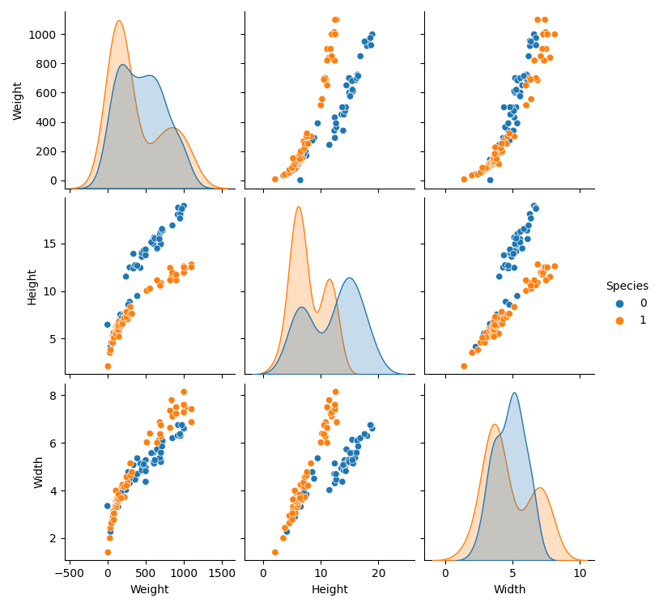
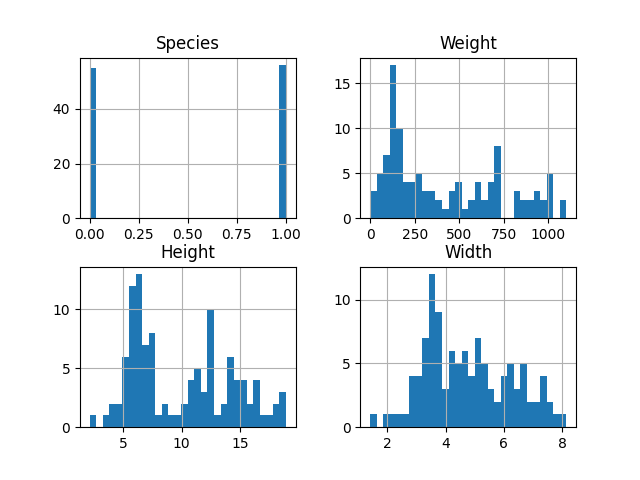

# Techniques de régression et de scoring

Nom  | Date | Sujet
:---: | :---: | :---:
Duval Axel | `09/01/2022` | [fish](https://plmlab.math.cnrs.fr/gdurif_teaching/polytech_ig5_regression_tutorial/-/blob/main/data/Fish.md)
___

## Choix des outils

Pour réaliser ce travail, j'ai choisi d'utiliser **python** pour diverses raisons:
- je ne suis pas un grand fan du langage **R**
- **python** est un langage de script également très utilisé dans la datascience
- j'ai l'habitude d'utiliser **python** et ses librairies de visualisation

Afin de profiter des avantages de ce language, j'utilise des librairies compatibles très connues comme:
- [matplotlib](https://matplotlib.org/) pour la visualisation
- [pandas](https://pandas.pydata.org/) pour manipuler les données
- [seaborn](https://seaborn.pydata.org/) pour de la visualisation orientée statistiques
- [sklearn](https://scikit-learn.org/stable/) pour effectuer la régression logistique
___

## Lecture du fichier
La première étape est de lire le fichier fourni. Cette lecture se fait simplement en utilisant la librairie [pandas](https://pandas.pydata.org/docs/reference/api/pandas.read_csv.html).

```python
with open('./fish.csv', newline='') as file:
    dataset = pd.read_csv(file, delimiter=';')
```
___

## Exploration des données
Une fois les données chargées dans un *dataset*, nous pouvons explorer les données pour voir à quoi elles ressemblent.

**Dimension du dataset**
```python
print(dataset.shape)

(111, 4)
```
> Nous avons donc un échantillon de données de 111 poissons et nous observons 4 différents critères. 

**Les premières entrées**
```python
print(dataset.head())

   Species  Weight   Height   Width
0        0   242.0  11.5200  4.0200
1        0   290.0  12.4800  4.3056
2        0   340.0  12.3778  4.6961
3        0   363.0  12.7300  4.4555
4        0   430.0  12.4440  5.1340

```
> On peut supposer que le poids est en gramme, et les mesures en centimètres.

**Les critères**
```python
print(dataset.keys())

Index(['Species', 'Weight', 'Height', 'Width'], dtype='object')
```

**Typage et taille des données**
```python
print(dataset.info())

Data columns (total 4 columns):
RangeIndex: 111 entries, 0 to 110
 #   Column   Non-Null Count  Dtype  
---  ------   --------------  -----  
 0   Species  111 non-null    int64  
 1   Weight   111 non-null    float64
 2   Height   111 non-null    float64
 3   Width    111 non-null    float64
dtypes: float64(3), int64(1)
memory usage: 3.6 KB
```
> Nous n'avons pas de données nulles ce qui est une bonne chose, le nettoyage de ces données ne devrait pas être trop long.

**Quelques mesures statistiques**
```python
print(dataset.describe())

          Species       Weight      Height       Width
count  111.000000   111.000000  111.000000  111.000000
mean     0.504505   415.048649    9.960117    4.764721
std      0.502247   318.618193    4.297672    1.476698
min      0.000000     0.000000    2.112000    1.408000
25%      0.000000   137.500000    6.191850    3.624000
50%      1.000000   300.000000    8.876800    4.566200
75%      1.000000   687.500000   13.680800    6.010500
max      1.000000  1100.000000   18.957000    8.142000
```
> On voit qu'il y a sans doute une erreur concernant un ou plusieurs poissons car le poids minimum est de 0g. Pour nous en assurer nous pouvons visualiser ces données.
___

## Visualisation des données
J'ai utilisé la fonction [pairplot de eaborn](https://seaborn.pydata.org/generated/seaborn.pairplot.html) pour obtenir cette figure qui permet de se rendre compte de la relation et la distribution de nos données.

```python
sns.pairplot(dataset, hue='Species')
```
 

Regardons d'un peu plus près nos critères à l'aide d'un histogramme tracé grâce à [matplotlib](https://matplotlib.org/).

```python
dataset.hist()
plt.show()
```


> On oberve qu'il y a environ 50% de poisson appartenant à l'espèce 1 et le reste à l'espèce 2.

> Grâce à ces figures on voit que la longueur semble bien distribuée entre tous les poissons en suivant une sorte de courbe de loi normale. Cependant, on observe pour la hauteur du poisson deux différents pics, comme si l'on avait deux lois normales centrées différement.
___

## Nettoyage des données
Nous avons vu qu'il y avait, pour certains poissons, un poids égal à 0 grammes. Pour ne pas fausser nos résultats et entrainer notre futur modèle correctement il faut remplacer ce 0 par la moyenne ou la médianne de la série. J'ai choisi d'utiliser la moyenne.

Je modifie donc le dataset en conséquence
```python
weight_mean = dataset['Weight'].mean()
dataset['Weight'] = dataset['Weight'].replace(to_replace=0, value=weight_mean)
```
___

## Modèle de régression

**Décomposition du *dataset***
Pour effectuer la régression il nous faut décomposer le *dataset* en 2 vecteurs, X et y.
```python
X = dataset.drop('Species', axis=1)
y = dataset['Species']
```
> Le vecteur X contient uniquement les attributs des poissons (*dim 111x3*). Tandis que le vecteur y contient uniquement l'espèce (*dim 111x1*).

**Découpage des vecteurs**
Il faut ensuite découper nos vecteurs en 2 parties:
- une pour entrainer le modèle
- une pour tester la validité du modèle.

Pour faire celà j'utilise la fonction [train_test_split de sklearn](https://scikit-learn.org/stable/modules/generated/sklearn.model_selection.train_test_split.html).
```python
X_train, X_test, y_train, y_test = train_test_split(X, y, test_size=0.2, random_state=555)
```
> J'ai choisi de prendre 80% des données pour entrainer le modèle. Le `random_state` aussi appelé `seed` permet de reproduire le caractère aléatoire de la séparation du dataset, je l'ai fixé à 555 mais nous verrons ensuite qu'il est possible de le changer.

**Choix du modèle**
Nous pouvons à présent instancier notre modèle de régression. J'utilise encore une fois sklearn et plus partculièrement leur [modèle de régression logistique](https://scikit-learn.org/stable/modules/generated/sklearn.linear_model.LogisticRegression.html) qui permet de faire de la *Binary Classification*.
```python
lr = LogisticRegression(penalty='l2', tol=0.0000001)
```
> J'ai choisi d'utiliser la [ridge Regression](https://en.wikipedia.org/wiki/Ridge_regression#:~:text=Ridge%20regression%20is%20a%20method,econometrics%2C%20chemistry%2C%20and%20engineering.)(`'l2'`) pour la pénalité car les variables sont très corrélées (voir figures précédentes). J'ai choisi une très faible tolérance de 10e-6 car je n'ai pas beaucoup de données.

**Entraînement**
```python
lr.fit(X_train, y_train)
```
> Cet entrainement aussi appelé le `fit` est très rapide car nous avons un très petit jeu de données.

**Prédiction**
Il est temps à présent de voir si notre modèle est bien paramétré et s'il est performant. Il va devoir prédire, à l'aide du jeu de données de test, l'espèce de ces poissons.
```python
prediction = lr.predict(X_test)
print(prediction)

[0 0 0 1 1 1 0 0 1 0 0 0 0 1 0 0 1 1 1 1 1 0 0]
```
> Le tableau ci-dessus représente la prédiction de l'espèce des poissons du jeu de donnée de test.
___

## Performance du modèle
Notre modèle à su prédire l'espèce des poissons mais il s'est peut être parfois trompé. C'est pour celà que nous devons confronter notre modèle à la réalité. Pour celà j'utilise les fonctions [classification_report](https://scikit-learn.org/stable/modules/generated/sklearn.metrics.classification_report.html) et [confusion_matrix](https://scikit-learn.org/stable/modules/generated/sklearn.metrics.confusion_matrix.html) de sklearn.
```python
print(classification_report(y_test, prediction))

              precision    recall  f1-score   support

           0       1.00      0.93      0.96        14
           1       0.90      1.00      0.95         9

    accuracy                           0.96        23
   macro avg       0.95      0.96      0.96        23
weighted avg       0.96      0.96      0.96        23
```
> On voit que notre modèle est très précis (accuracy = 96%). Il arrive parfaitement à détecter les poissons de l'espèce 0 et se débrouille également très bien avec ceux de l'espèce 1. Le recall et également très bon pour les deux espèces.C'est peut être un coup de chance, il est possible que les données de test soient favorables ou que notre modèle ait fait du sur-apprentissage. Pour s'en assurer il faudrait entrainer et tester diverses parties de notre *dataset* et c'est ce que nous allons faire ensuite.

```python
print(confusion_matrix(y_test, prediction))

[[13  1]
 [ 0  9]]
```
> On observe que les 13 poissons qui ont été classé dans l'espèce 0 sont bien classés. Les 9 poissons classé dans l'espèce 1 sont eux aussi bien classés. En fait il y a eu un seul poisson qui a été mal classé. Le modèle à prédit qu'il faisait parti de l'espèce 0 alors qu'il est en réalité de l'espèce 1.

**Reproductibilité**
Nous avons très peu de données dans notre *dataset* et encore moins dans notre jeu de test, c'est pourquoi le modèle à peu être sur-appris. Je vais donc instantier 100 modèles différents avec des jeux de tests différents pour voir si le modèle se débrouille toujours aussi bien.
```python
lr = LogisticRegression(penalty='l2', tol=0.0000001)
p = []
for i in range(100):
    X_train, X_test, y_train, y_test = train_test_split(X, y, test_size=0.2, random_state=i)
    lr.fit(X_train, y_train)
    prediction = lr.predict(X_test)
    p.append(classification_report(y_test, prediction,output_dict=True)["accuracy"])
print(statistics.mean(p))

0.851304347826087
```
> La précision moyenne sur les 100 modèles est de 85%. C'est un très bon score et on se rends compte que le `random_state=555` était, en effet, un cas particulier.
___

## Conclusion
Lors de ce TP, j'ai pu prédire l'espèce de nouveaux poissons en fonction de leur taille et de leur poids grâce à un modèle de régression logistique. Nous avons vu que le fait d'avoir un faible jeu de données fait varier la perfomance de notre modèle. Il aurait fallu avoir plus de données pour avoir une précision plus stable.


[Lien github](https://github.com/Axel-Duval/fish)
